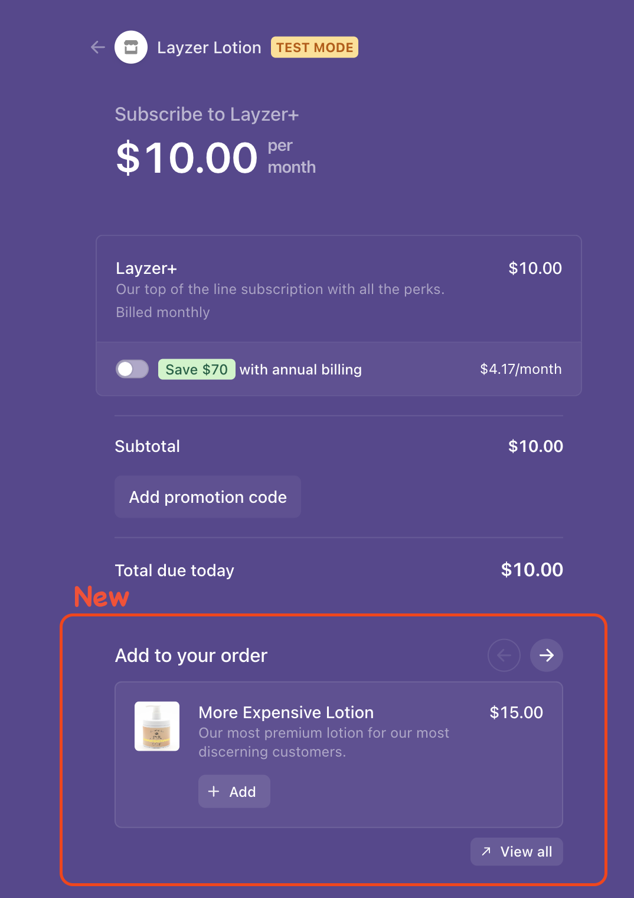
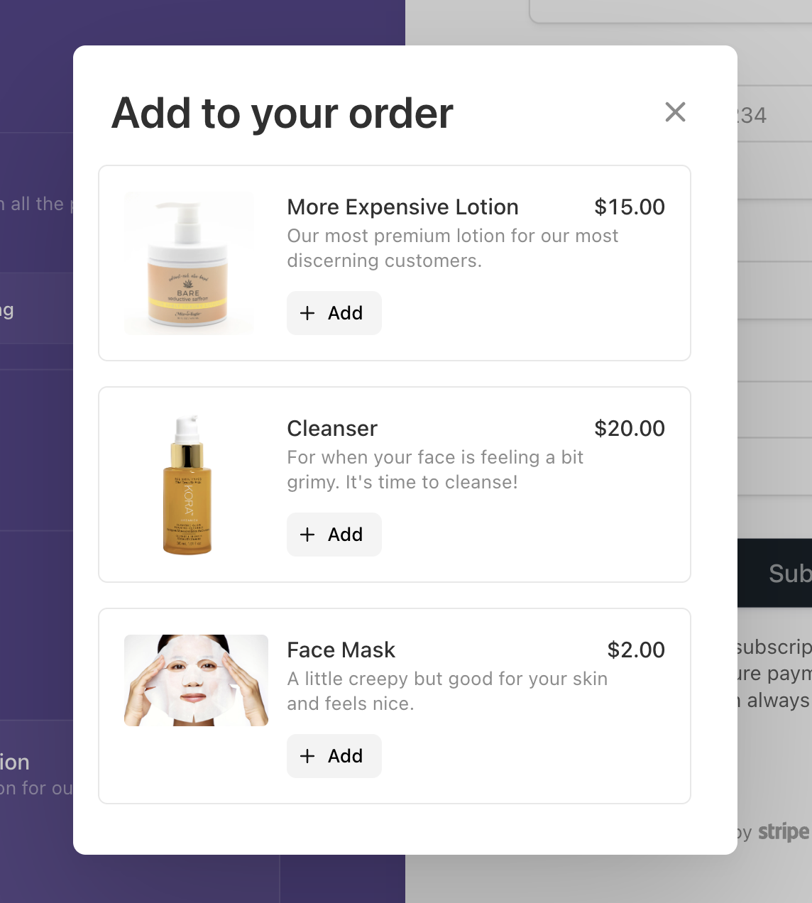

# Private Preview: Optional items in Checkout
Hi there! We are excited for you to start trying out the new “optional items” feature in Checkout!

## What are optional items?
The new “optional items” feature is a way for you to offer optional items that customers can choose to add to their order at checkout. Think of these as a more flexible, powerful, and easy to use alternative to Checkout’s current [cross-sells](https://docs.stripe.com/payments/checkout/cross-sells) feature.

## What do customers see in Checkout?
Customers see a carousel at the bottom of the order summary offering additional items they can optionally add to their order during checkout. Clicking “View all” opens a modal where customers can easily view all the items available to add.



	
## How do I use optional items?
Now that you’ve been granted preview access to use his feature, creating a Checkout Session with optional items should be simple! You pass `optional_items` in your Checkout Session creation call in the same way that you pass `line_items`, passing a `price` ID and a `quantity`.

```javascript
await stripe.checkout.session.create({
	line_items: [
		{
			price: "priceA",
			quantity: 1,
		}
	],
	optional_items: [
		{
			price: "priceB",
			quantity: 1,
		},
		{
			price: "priceC",
			quantity: 1,
		},
		{
			price: "priceD",
			quantity: 1,
		},
	],
});
```

You can also allow customers to adjust the quantity of an optional item once it is added to their cart by passing `adjustable_quantity` (just like you do with line items). For example, if you want the initial quantity to be 1 and for the customer to be able to purchase up to 5, you would do the following

```javascript
await stripe.checkout.session.create({
	...
	optional_items: [
		{
			price: "priceB",
			quantity: 1,
			adjustable_quantity: {
				enabled: true,
				maximum: 5,
			},
		},
	],
});
```

With optional items, you can also specify a minimum quantity greater than 0, however the customer will always be able to remove the item from their order. It is optional after all!

```javascript
await stripe.checkout.session.create({
	...
	optional_items: [
		{
			price: "priceB",
			quantity: 3,
			adjustable_quantity: {
				enabled: true,
				minimum: 3,
				maximum: 5,
			},
		},
	],
});
```

In the above example, when the customer clicks to add the optional item to their order, the initial quantity will be 3, adjustable between 3 and 5, and the customer can always remove the item from their order entirely.

## Limitations
The Optional items feature has some limitations to be aware of…

- You cannot specify more than 10 optional items
  - *If this is a limiting factor for you, we’d love to learn more about your use case!*
- You cannot specify a recurring optional item if a line item has a subscription upsell configured
  - *We understand that this is a pain point for some users and hope to address it soon.*
- You cannot specify an optional item using custom amounts or use optional items when a line item is using custom amounts.
- The billing interval of any recurring optional items (monthly, yearly, etc) must match the interval of the recurring line items.
- Cross-sells configured in the Product catalog will not appear on Checkout Sessions created with optional items
- You cannot use optional items in `setup` mode.
- You cannot specify recurring optional items in `payment` mode.

## We’d love to hear from you!
As you add this new feature to this integration, we’d love to hear about how the feature works for your use case, what limitations are particularly frustrating or blocking for your business. Please feel free to [schedule some time](https://calendar.app.google/CwtaHyacgBmnkHRD6)!
